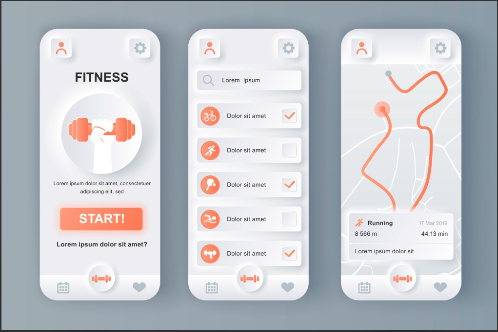


Chào bạn, dự án Calo Tracker của bạn có luồng nghiệp vụ rất rõ ràng. Việc bạn chọn tech stack Next.js 14 (App Router) + Supabase là một quyết định cực kỳ tối ưu cho một solo developer với tiêu chí chi phí thấp và dễ bảo trì.

Nếu bạn đã quen với ASP.NET Web Forms hay hệ thống xử lý logic trên backend truyền thống, bạn sẽ thấy tính năng **Server Actions** của Next.js 14 khá thú vị — nó mang lại cảm giác xử lý logic phía server cực kỳ mượt mà ngay trong các component React mà không cần phải viết API riêng lẻ.

Dưới đây là một số ý tưởng cải tiến (features) để ứng dụng của bạn "hay ho" và giữ chân người dùng tốt hơn, kèm theo lộ trình triển khai chi tiết.

## 1. Đề xuất các tính năng nâng cao

**A. Gamification & Trải nghiệm người dùng (UX)**

* **Streak (Chuỗi ngày):** Tính năng đếm số ngày liên tục người dùng nhập log bữa ăn hoặc hoàn thành mục tiêu calo. Đây là "vũ khí" cực mạnh để tạo thói quen (như cách Duolingo làm).
* **Water Tracker (Theo dõi uống nước):** Thêm một module nhỏ để tick số ly nước đã uống trong ngày. Rất dễ code (chỉ cần 1 bảng DB đơn giản) nhưng người dùng lại cực kỳ thích.

**B. Phân tích & Trực quan hóa dữ liệu (Data Visualization)**

* **Macro Tracking:** Đừng chỉ dừng ở Calo tổng. Hãy bóc tách Protein, Carbs, Fat. Việc hiển thị bằng các biểu đồ hình tròn (Pie Chart) hoặc thanh tiến trình (Progress Bar) sẽ giúp app trông chuyên nghiệp hơn hẳn.
* **Weekly/Monthly Report:** Tổng kết lại một tuần qua người dùng đã làm được gì (Ví dụ: "Tuần qua bạn đã thâm hụt được 3500 kcal, tương đương nửa kg mỡ!").

**C. Đảm bảo chất lượng (QA) & Luồng logic**

* **Kiểm thử Hộp trắng & Hộp đen (White-box/Black-box Testing):** Các công thức tính BMR, TDEE, và thâm hụt calo là "trái tim" của ứng dụng. Bạn nên thiết kế các test case kỹ lưỡng bao phủ mọi nhánh logic (đặc biệt là các biên tuổi, cân nặng, hoặc mức độ vận động) để đảm bảo không gợi ý sai mục tiêu dinh dưỡng cho người dùng.

**D. Định hướng Growth/Marketing**

* **Nút "Share Progress":** Cho phép người dùng tạo một ảnh chụp nhanh (snapshot) về chuỗi ngày Streak hoặc thành tích giảm cân của họ để chia sẻ lên Facebook, TikTok hoặc các mạng xã hội khác. Đây là cách tự nhiên nhất để ứng dụng của bạn tiếp cận nhiều người dùng mới (Organic Traffic).
* 

## 2. Lộ trình triển khai (Project Plan)

Để không bị ngợp, bạn có thể áp dụng quy trình quản lý task (như Jira hoặc GitHub Projects) và chia dự án thành các giai đoạn sau:

Phase 1: Hoàn thiện Core MVP

Hiện tại

* Thiết lập dự án trên Supabase Cloud (lấy API Key).
* Cấu hình Supabase Auth để người dùng có thể đăng nhập/đăng ký.
* Viết các Server Actions để thực hiện CRUD (Create, Read, Update, Delete) cho bảng `meals_log` và `goals`.
* Thiết lập Row Level Security (RLS) trên Supabase để user nào chỉ thấy data của user đó.

Phase 2: Nâng cấp UI & Dữ liệu

Tiếp theo

* Tích hợp biểu đồ (có thể dùng thư viện `Recharts` hoặc `Chart.js`) để vẽ biểu đồ Calo và Macros.
* Thêm tính năng Water Tracker cơ bản.
* Xây dựng database nội bộ cho các món ăn Việt Nam (`food_items`).

Phase 3: Gamification & Social

Mở rộng

* Viết logic tính toán Streak đếm số ngày đăng nhập/nhập liệu liên tiếp.
* Xây dựng component "Share Progress" (có thể dùng thư viện html2canvas để biến một vùng div thành ảnh tải xuống được).
* Thiết lập Web Push API (Service Worker) để nhắc nhở tập luyện.

Phase 4: Testing & Automation

Đảm bảo chất lượng

* Viết Unit Test cho các hàm tính toán BMR, TDEE.
* Áp dụng kiểm thử hộp trắng cho luồng xử lý `ApplyGoal` hoặc `CalculateDeficit`.
* Đưa dự án lên GitHub và thiết lập GitHub Actions để tự động chạy Test/Lint mỗi khi push code lên Vercel.

Phase 5: Tích hợp AI Vision

Tương lai

* Bổ sung luồng: User upload ảnh món ăn -> Lưu vào Supabase Storage.
* Gửi URL ảnh qua API của Gemini hoặc GPT-4V.
* Bóc tách kết quả JSON trả về để map với DB món ăn.
